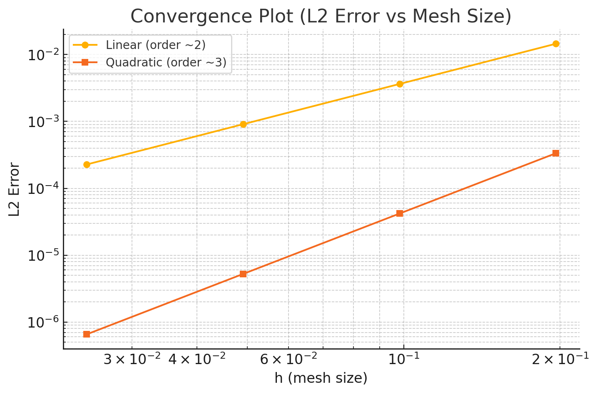
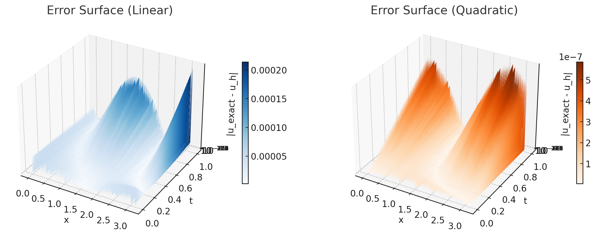

# 1D Finite Element Method (FEM) for Time-dependent Boundary Value Problem

This project implements a one-dimensional FEM solver for a time-dependent boundary value problem using both linear (P1) and quadratic (P2) shape functions. It demonstrates temporal discretization via the Crank–Nicolson method and compares numerical solutions with exact solutions.

## 🔧 Files Overview

- `fn.py`: Core FEM routines (shape functions, integrators, stiffness/mass matrix assemblers).
- `myFE1dibvp.py`: Main solver using Crank–Nicolson for time integration.
- `figures/`: All related visualizations for computed vs exact solution and error analysis.

## 📈 Features

- Linear and quadratic shape functions.
- Time integration via Crank–Nicolson scheme.
- Error visualization over time and space.
- Convergence rate evaluation confirming:
  - 2nd-order accuracy for linear elements.
  - 3rd-order accuracy for quadratic elements.

## 📊 Sample Outputs




## 🧪 Problem Setup

**PDE**:  
`u_t - (a(x)u_x)_x + c(x)u = f(x,t),  0 < x < π, 0 < t < 1`

**Initial condition**:  
`u(x,0) = cos(x)`

**Boundary conditions**:  
`u(0,t) = 1`,  
`a(x) * u_x(π, t) = Q_L(t)`

## 🧠 Exact Solution

The exact solution used for validation is:
```python
def exact_solution(x, t):
    return (1 - 2*x*t) * np.cos(x)
```

## 📎 Usage

```python
from myFE1dibvp import myFE1dibvp

# Define problem parameters (see Report for full setup)
uh, W = myFE1dibvp(a, c, f, p0, QL, u0, L, T, dt, noOfEle, shapeFn=1)
```
